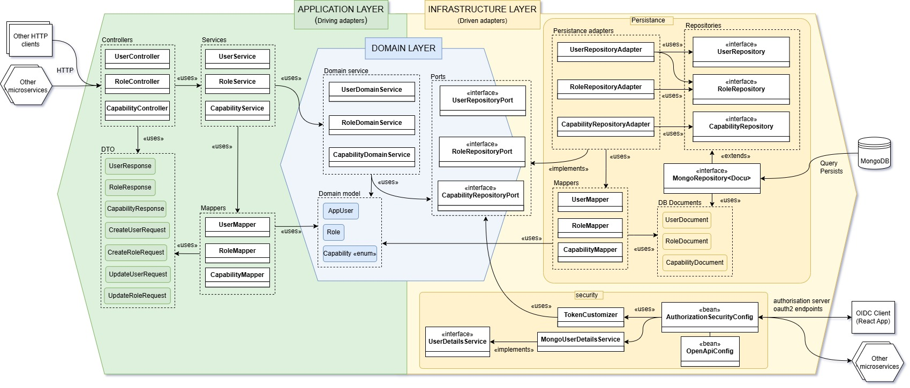
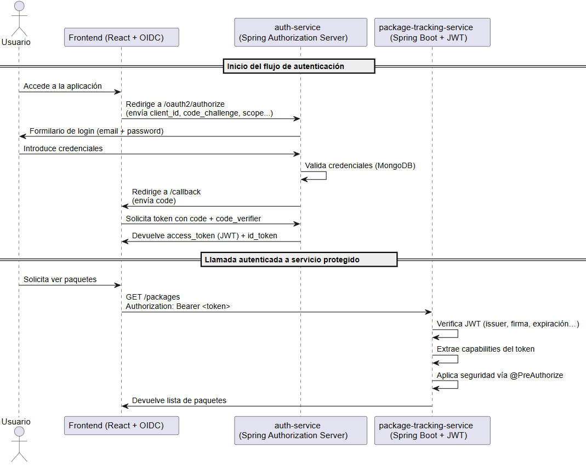

# auth-service

[](https://github.com/amollrod/package-tracking-service/actions/workflows/pipeline.yml)
[](https://www.gnu.org/licenses/gpl-3.0.html)
[](https://creativecommons.org/licenses/by-nc/3.0/es/)

Este microservicio forma parte del sistema `ParcelTrust`, desarrollado como Trabajo de Fin de Grado. Su responsabilidad principal es gestionar la autenticación y autorización de los usuarios mediante OAuth2 y JWT, funcionando como un Authorization Server compatible con OpenID Connect.



---

## Tecnologías utilizadas

* **Java 17** + **Spring Boot 3**
* **Spring Authorization Server** 1.4.2
* **MongoDB** para persistencia de usuarios, roles y capacidades
* **OAuth2 + JWT** con Proof Key for Code Exchange (PKCE)
* **Docker + Docker Compose** para despliegue

---

## Responsabilidad del microservicio

* Actuar como servidor de autorización OAuth2
* Emitir tokens JWT seguros con claims personalizados
* Autenticar usuarios y verificar roles y capacidades
* Almacenar y gestionar usuarios, roles y capabilities en MongoDB

---

## Estructura del proyecto

```
auth-service
├── application
│   ├── config                # Beans de configuración de dominio
│   ├── controllers           # Endpoints REST
│   ├── dto                   # DTOs de entrada/salida
│   ├── exceptions            # Control de errores de capa aplicación
│   ├── mapper                # Mapeadores entre entidades y DTOs
│   └── services              # Lógica de aplicación
├── domain
│   ├── exceptions            # Excepciones de dominio
│   ├── models                # Modelos de usuario, rol, capability
│   ├── ports                 # Interfaces para acceso a datos
│   └── services              # Lógica de negocio
├── infrastructure
│   ├── adapters
│   │   └── persistence
│   │       ├── adapter       # Implementación de puertos
│   │       ├── document      # Entidades persistentes MongoDB
│   │       ├── mapper        # Mapeadores de documentos a modelos
│   │       └── repository    # Repositorios Mongo
│   ├── adapters.security     # Servicios de seguridad (UserDetailsService...)
│   ├── config                # Configuración del Authorization Server
│   └── exceptions            # Excepciones técnicas
├── test                      # Tests unitarios e integración
└── resources
    └── static                # Favicon y recursos estáticos
```

---

## Seguridad y autenticación

Este microservicio actúa como un Authorization Server compatible con OAuth2 y OpenID Connect. Implementa el flujo Authorization Code con PKCE, ideal para aplicaciones SPA o móviles.



### Flujo de autenticación

1. El frontend redirige al usuario a `http://localhost:8082/oauth2/authorize` con los parámetros `client_id`, `redirect_uri`, `code_challenge`, `code_challenge_method` y `response_type=code`.
2. El usuario se autentica mediante un formulario (`formLogin`) que valida contra la base de datos MongoDB.
3. El servidor devuelve un `authorization code` al `redirect_uri`.
4. El frontend hace una petición al endpoint `/oauth2/token` incluyendo el `code_verifier`.
5. Si el código es válido, se emite un `access_token` y `refresh_token`.
6. El token JWT contiene los claims personalizados:

```json
{
  "sub": "user@example.com",
  "roles": ["ADMIN"],
  "capabilities": ["CREATE_PACKAGE", "FIND_PACKAGE"],
  "scope": "openid",
  "iss": "http://auth-service.localtest.me:9000"
}
```

### Configuración destacada

* `MongoUserDetailsService` se encarga de cargar los usuarios desde MongoDB.
* `TokenCustomizer` añade claims personalizados (roles y capabilities) al token JWT.
* `AuthorizationSecurityConfig` configura los endpoints de seguridad y el servidor de autorización.

---

## Endpoints de la API REST

### Usuarios

| Método | Endpoint         | Descripción                  | Seguridad (@PreAuthorize) |
| ------ | ---------------- | ---------------------------- | ------------------------- |
| GET    | `/users`         | Obtener todos los usuarios   | `VIEW_USERS`              |
| GET    | `/users/{email}` | Obtener un usuario por email | `VIEW_USERS`              |
| POST   | `/users`         | Crear nuevo usuario          | `CREATE_USER`             |
| PUT    | `/users/{email}` | Actualizar usuario existente | `UPDATE_USER`             |
| DELETE | `/users/{email}` | Eliminar usuario             | `DELETE_USER`             |

### Roles y Capabilities por role

| Método | Endpoint        | Descripción               | Seguridad (@PreAuthorize) |
| ------ | --------------- | ------------------------- | ------------------------- |
| GET    | `/roles`        | Obtener todos los roles   | `VIEW_ROLES`              |
| GET    | `/roles/{name}` | Obtener un rol por nombre | `VIEW_ROLES`              |
| POST   | `/roles`        | Crear nuevo rol           | `CREATE_ROLE`             |
| PUT    | `/roles/{name}` | Actualizar un rol         | `UPDATE_ROLE`             |
| DELETE | `/roles/{name}` | Eliminar un rol           | `DELETE_ROLE`             |

| Método | Endpoint                            | Descripción                             | Seguridad (@PreAuthorize) |
| ------ | ----------------------------------- | --------------------------------------- | ------------------------- |
| PATCH  | `/roles/{name}/capabilities/add`    | Añadir una capability al rol            | `UPDATE_ROLE`             |
| PATCH  | `/roles/{name}/capabilities/remove` | Eliminar una capability del rol         | `UPDATE_ROLE`             |
| PATCH  | `/roles/{name}/capabilities/clear`  | Eliminar todas las capabilities del rol | `UPDATE_ROLE`             |

> Los endpoints están protegidos con `@PreAuthorize` y requieren tokens válidos con las capacidades apropiadas.
> Todos los endpoints están documentados mediante [Swagger UI](http://localhost:8082/swagger-ui/index.html).

---

## CI/CD y despliegue

Este microservicio está integrado con GitHub Actions mediante workflows:

* `unit-tests.yml`: ejecuta tests con cobertura
* `integration-tests.yml`: tests de integración aislados
* `docker-publish.yml`: construye y publica la imagen Docker
* `pipeline.yml`: orquesta tareas anteriores

### Despliegue local

Asegúrate de tener Docker Desktop en ejecución:

```bash
docker-compose up
```

Esto lanza `auth-service` en `http://localhost:8082/`, junto con MongoDB configurado mediante el perfil `application-docker.properties`. Además, se provee un well-known endpoint en `http://localhost:8082/.well-known/oauth-authorization-server` para compatibilidad con OpenID Connect.

---

## Licencias

* Este repositorio está licenciado bajo los términos de la [GNU General Public License v3.0](./LICENSE)
* La memoria del TFG está protegida bajo: [CC BY-NC 3.0 España](https://creativecommons.org/licenses/by-nc/3.0/es/) y [GNU Free Documentation License 1.3](https://www.gnu.org/licenses/fdl-1.3.html)

Proyecto desarrollado como parte del TFG de **Alex Moll Rodríguez** para la **UOC** en 2025.
